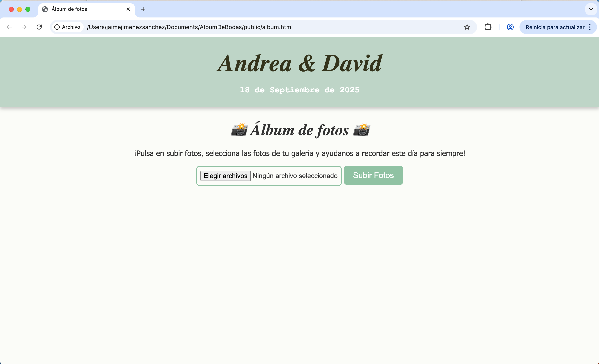
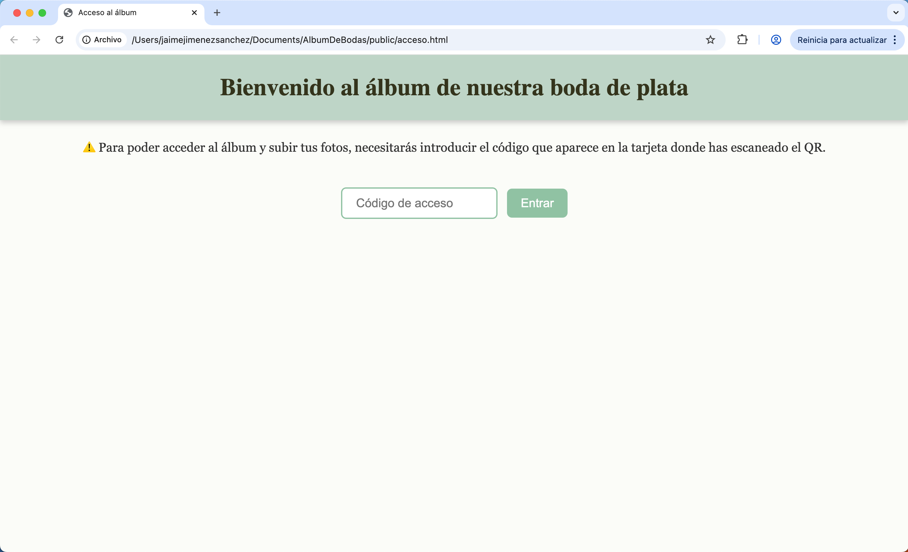
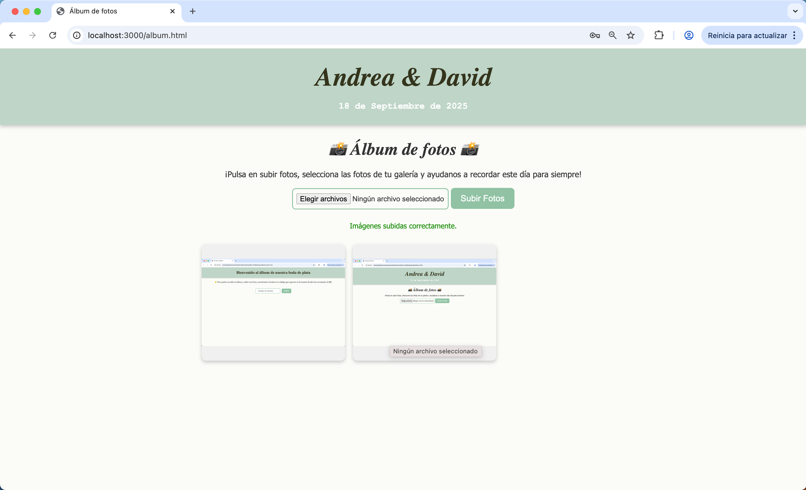

# 📸 Web para Subir Fotos de Nuestra Boda

¡Bienvenidos al repositorio de nuestra web de fotos de boda! 🎉  
Es una aplicación web muy sencilla para que todos los invitados de nuestra boda puedan subir las fotos que tomen durante el gran día, ¡y así compartir recuerdos juntos! 💕
Es totalmente responsive pudiendo acceder tanto desde el navegador móvil como desde el ordenador.

---

## 🌐 Demo

Aquí puedes ver una demo de cómo funciona la app:

### Código de acceso

  

### Subida de Imagen

  

### Galería de Imágenes

  

---

## 🚀 Funcionalidades

- 📤 Subida de imágenes desde el navegador web del ordenador o móvil.
- 🖼️ Pantalla principal con la vista previa de las imágenes.
- 🔐 Contraseña para acceder al álbum.
- 📱 Diseño responsive para móviles.
- ☁️ Almacenamiento en el servidor

---

## ⚙️ Tecnologías

- **Frontend**: HTML, CSS, JavaScript
- **Backend**: Node.js
- **Almacenamiento**: Servidor
